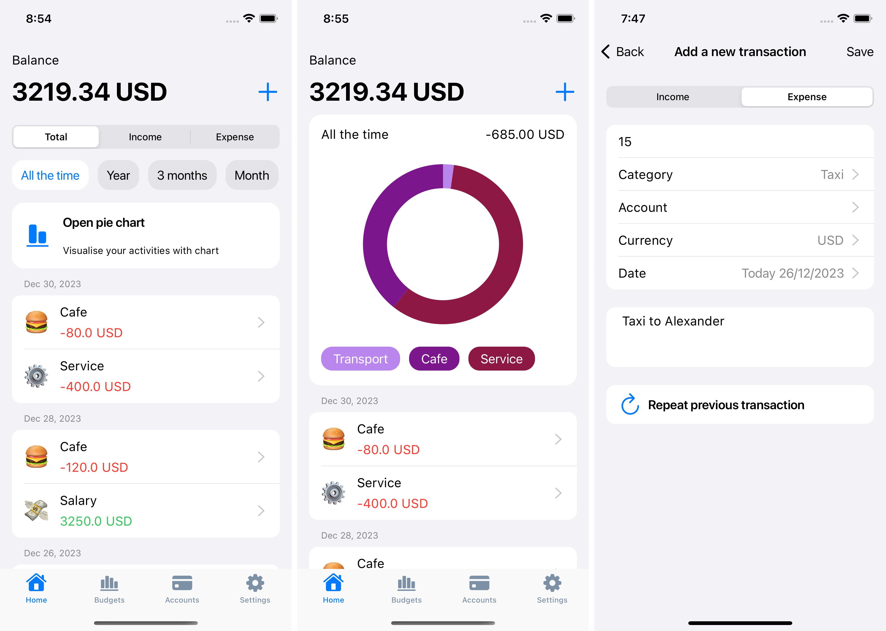
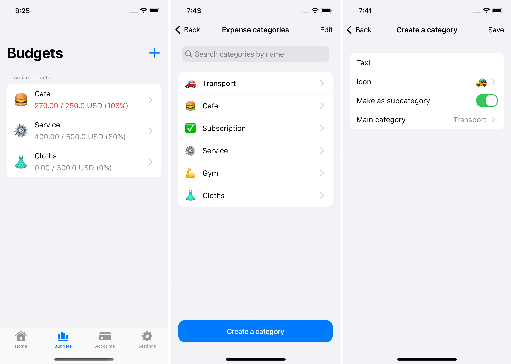
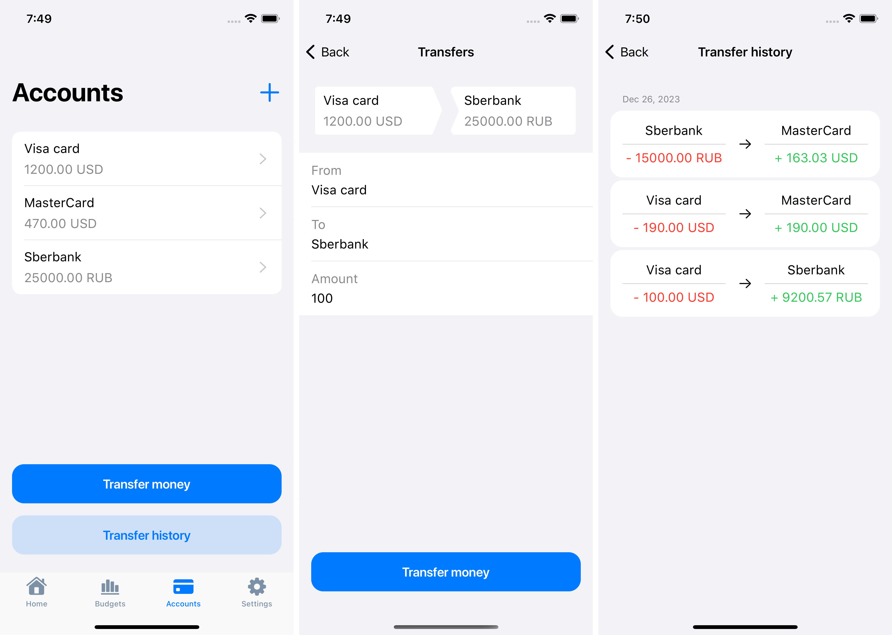
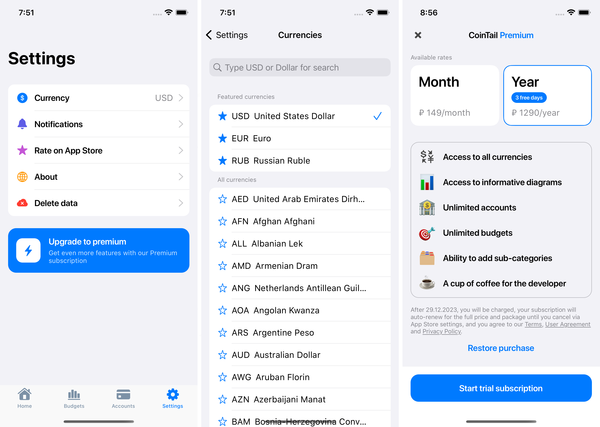

# Table of Contents
1. [CoinTail description](#cointail-description)
2. [Screenshots](#screenshots)
3. [Structure](#structure)
4. [Requirements](#requirements)
5. [Dependencies](#dependencies)
6. [API](#api)
7. [Meta](#meta)

## CoinTail description
<p>CoinTail is a straightforward iOS application designed to optimize financial management.<br> 
Users can easily record their expenses and income, create categories, manage accounts, and monitor their budget through an intuitive design. Notifications for daily or weekly entries help maintain financial discipline.<br> 
CoinTail provides visualization of financial data using diagrams and also supports multi-currency transactions with easy currency conversion. The ability to analyze and make informed decisions makes CoinTail a valuable tool for effective financial management.</p>

## Screenshots





## Structure 
* "Application": Application launch files (info.plist, AppDelegate.swift, LaunchScreen.storyboard).
* "Storage": Models and singletons for managing them, setting up the Realm database, Keychain for storing API keys, setting up RevenueCat for working with payments, currency conversion API.
* "TabBar": Hierarchy of screens located on the TabBar. 
* "Extensions": Extensions to standard classes for UIKit, Foundation and RevenueCat. Basic controller classes to simplify working with screens.
* "Resources": Fonts, assets with pictures and colors, Localizable files for translation into Russian.
  
## Requirements
- iOS 12.0+
- Xcode 14.0+

## Dependencies
[CocoaPods](https://cocoapods.org) is used as a dependency manager.
List of dependencies: 
* pod 'EasyPeasy' -> A library that makes it easy to organize constraints and animations for the user interface.
* pod 'RevenueCat' -> Toolkit for managing paid subscriptions, providing a turnkey solution for implementing and tracking payments.
* pod 'SwiftLint' -> A tool for automatically checking the style and conventions of Swift code, ensuring consistency and cleanliness of code.
* pod 'RealmSwift' -> A database for storing and managing data in Swift, providing a convenient interface for working with objects and queries.
* pod 'Charts' -> A library for creating colorful and interactive charts that provide powerful data visualization.
* pod 'Sentry' -> A useful tool for tracking errors in real time on user devices. Sends detailed information about the error and a screenshot of the screen on which the error was noticed.

### Installation
Place the following code in your `Podfile`:
```ruby
source 'https://github.com/CocoaPods/Specs.git'
platform :ios, '14.0'

target 'CoinTail' do
  use_frameworks!

  pod 'EasyPeasy'
  pod 'RevenueCat', '4.17.10'
  pod 'RealmSwift'
  pod 'SwiftLint'
  pod 'Charts'
  pod "KeychainSwift", '20.0.0'
  pod 'Sentry', :git => 'https://github.com/getsentry/sentry-cocoa.git', :tag => '8.1.0'

end

post_install do |installer|
    installer.generated_projects.each do |project|
        project.targets.each do |target|
            target.build_configurations.each do |config|
                config.build_settings['IPHONEOS_DEPLOYMENT_TARGET'] = '14.0'
            end
        end
    end
end
```

To access the contents of the pods, import modules wherever you import UIKit or Foundation:

``` swift
import UIKit
import RealmSwift
```

## API 
API requests for currency conversion are taken from the site https://app.exchangerate-api.com.<br>
For the API to work correctly, you need to register on the website and get the key in the [dashboard tab](https://app.exchangerate-api.com/dashboard). This key should then be placed in <b>CoinTail->Storage->Keychain->KeychainManager.swift</b> in the <b>apiKey</b> constant.<br>
It’s simply not possible to test payments in the application via the API. You need to register a developer account in App Store Connect and create subscriptions for this application, then duplicate these same subscriptions on the RevenueCat website so that they can be fully used.

## Meta
Gmail – kunavinjenya55@gmail.com<br>
Telegram - https://t.me/just_eugeny<br>
LinkedIn - https://www.linkedin.com/in/kunav1n/

Distributed under the MIT license. See ``LICENSE`` for more information.
